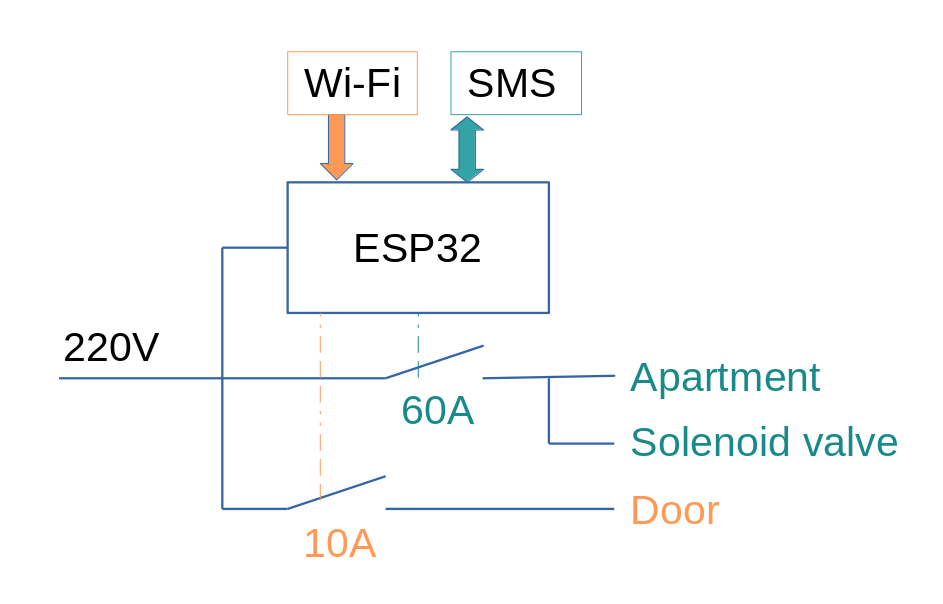

<h1 align="center">
   
  
</h1>

<h4 align="center">Box Airbnb - domotics with SMS and Wi-Fi with ESP32 microcontroller</h4>

## Overview

Box Airbnb provides the floowing features:

### Domotics through SMS messages

Using an SIM800L or equivalement chip interfaced with ESP32 microcontroller

### Door opening by connecting to a wifi network with the correct password

By setting up a Wi-Fi network as an access point, the server can monitor when a Wi-Fi client has connected. With this project, it opens a relay that can open a door.

## Green Technology

Box Airbnb embraces green technology by promoting energy efficiency. Through the domotics features, it allows for intelligent control of power usage in apartments, reducing unnecessary energy consumption when no one is present. This not only helps to save energy but also contributes to a more sustainable environment.

Moreover, the domotics system can also prevent water wastage by addressing potential issues such as leaks. When there are no tenants present, the system can automatically shut off the water supply using solenoid valves, preventing water leaks or any unnecessary water usage. This proactive approach ensures efficient water management, reducing water waste and promoting a greener living environment.

## Hardware Requirements

### Computer System

A ESP32 microcontroller and 2G, 3G or 4G sim card controller. T-Call from LillyGo have both ESP32 and GSM module on same ship.

### Domotics

You will need some relays that are compatible with GPIO 3V & 5V. Additionally, dépending on your needs, you may require an electronic locker, an electrovalve.

